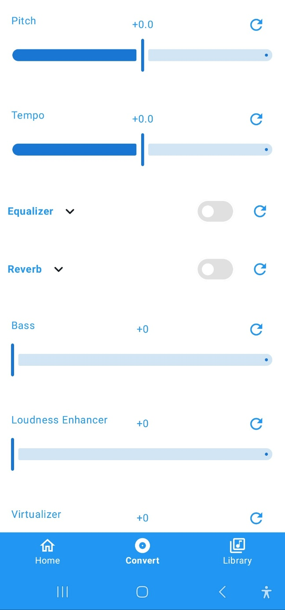

# Transpose

Transpose is an open-source, ad-free YouTube client for Android, built with Kotlin and Jetpack Compose. It offers a unique feature set focused on audio manipulation and an enhanced viewing experience.

[한국어 버전 (Korean version)](README_KO.md)

## Features

### 🎵 Real-time Audio Effects (No Download Required!)
Our standout feature is the ability to apply audio effects to YouTube videos in real-time, without downloading the audio file:
- **Pitch Adjustment**: Modify the pitch of the audio
- **Tempo Control**: Speed up or slow down the playback without affecting pitch
- **Equalizer**: Fine-tune the audio frequencies
- **Preset Reverb**: Add space and depth to the sound
- **Bass Boost**: Enhance the low-end frequencies
- **Loudness Enhancer**: Increase the perceived volume
- **3D Audio Effects**: Create an immersive sound experience
- **Audio-reactive Vibration**: Feel the music with vibration effects

### 🔍 Comprehensive Search
- Search for any video within YouTube's vast library

### 🎨 Customizable Playback
- Background playback: Continue listening with the screen off or while using other apps
- Adjust audio effects from the notification bar during background playback

### 📋 Playlist Management
- Create and manage playlists of your favorite videos
- Add videos to playlists for easy access

### 🚫 Ad-Free Experience
- Enjoy YouTube content without any advertisements

### 💾 Local File Playback
- Browse and play local video and audio files
- Apply the same powerful audio effects to your local media

## Screenshots

| Home Screen | Convert Screen | Library Screen |
|:-----------:|:--------------:|:--------------:|
|  |  |  |

## Upcoming Features (Todo List)

- [ ] Instrumental Effect (Vocal Removal)
- [ ] Like functionality
- [ ] Viewing history
- [ ] Channel browsing
- [ ] Playlist overview

## Installation

The latest beta version of Transpose is now available!

You can download the latest APK from my [GitHub Releases page](https://github.com/joh9911/Transpose/releases/tag/v0.1.0-beta).

Please note that this is a beta release and may contain bugs. We appreciate your feedback to help improve Transpose!

## Technology Stack

- Kotlin
- Jetpack Compose
- Android Jetpack Components:
  - ViewModel
  - Navigation
  - Room
  - LiveData
- RxJava
- Retrofit2
- Media3 (ExoPlayer)
- MVVM + Repository pattern

## Contributing

We welcome contributions! If you'd like to contribute, please follow these steps:

1. Fork the repository
2. Create your feature branch (`git checkout -b feature/AmazingFeature`)
3. Commit your changes (`git commit -m 'Add some AmazingFeature'`)
4. Push to the branch (`git push origin feature/AmazingFeature`)
5. Open a Pull Request

## License

This project is licensed under GPL-3.0 license. See the `LICENSE` file for details.

## Disclaimer

This project is not affiliated with, endorsed by, or sponsored by YouTube or any of its affiliates or subsidiaries. Any trademark, service mark, trade name, or other intellectual property rights used in this project are owned by the respective owners.

## Contact

Sungmin Joh - joh99111@gmail.com
