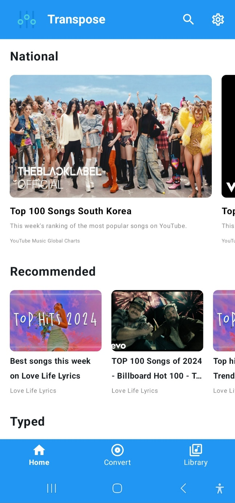

# Transpose

Transpose는 Kotlin과 Jetpack Compose로 개발한 오픈 소스, 광고 없는 Android용 YouTube 클라이언트입니다. 오디오 조작과 향상된 시청 경험에 중점을 둔 독특한 기능들을 제공합니다.

[English version (영어 버전)](README.md)

| 홈 화면 | 변환 화면 | 라이브러리 화면 |
|:-------:|:---------:|:---------------:|
|  |  |  |

## 설치 방법

Transpose의 최신 베타 버전을 지금 바로 이용해보세요!

 

[GitHub Releases 페이지](https://github.com/joh9911/Transpose/releases/tag/v0.1.0-beta)에서 최신 APK를 다운로드할 수 있습니다.

베타 버전이라 일부 버그가 있을 수 있습니다. Transpose를 더 좋게 만들기 위해 여러분의 소중한 의견을 기다리고 있습니다!

## 기능

### 🎵 실시간 오디오 효과 (다운로드 불필요!)
Transpose의 대표 기능은 YouTube 동영상의 오디오를 실시간으로 변경할 수 있다는 점입니다. 오디오 파일을 따로 다운로드할 필요 없이 다음과 같은 효과를 바로 적용할 수 있습니다:
- **피치 조절**: 오디오의 음높이 조정
- **템포 제어**: 음높이에 영향을 주지 않고 재생 속도 변경
- **이퀄라이저**: 오디오 주파수 세부 조정
- **리버브 프리셋**: 음향에 공간감과 깊이감 추가
- **베이스 부스트**: 저음역대 강화
- **음량 증폭**: 전반적인 음량 증가
- **3D 오디오 효과**: 입체적인 사운드 경험 제공
- **오디오 반응 진동**: 음악에 맞춘 진동 효과로 몰입감 향상

### 🔍 폭넓은 검색
- YouTube의 방대한 라이브러리 내 모든 동영상 검색 가능

### 🎨 맞춤형 재생
- 백그라운드 재생: 화면을 꺼도, 다른 앱을 사용해도 계속해서 음악 감상
- 백그라운드 재생 중에도 알림창에서 오디오 효과 조정 가능

### 📋 재생목록 관리
- 좋아하는 동영상으로 재생목록 생성 및 관리
- 쉽게 접근할 수 있도록 재생목록에 동영상 추가

### 🚫 광고 없는 경험
- 광고 없이 YouTube 콘텐츠를 즐기세요

### 💾 로컬 파일 재생
- 기기에 저장된 비디오와 오디오 파일 탐색 및 재생
- 로컬 미디어에도 동일한 강력한 오디오 효과 적용 가능

## 개발 예정 기능
- [ ] 악기 효과 (보컬 제거)
- [ ] 좋아요 기능
- [ ] 시청 기록
- [ ] 채널 탐색
- [ ] 재생목록 개요

## 사용 기술

- Kotlin
- Jetpack Compose
- Android Jetpack 컴포넌트:
  - ViewModel
  - Navigation
  - Room
  - LiveData
- RxJava
- Retrofit2
- Media3 (ExoPlayer)
- MVVM + Repository 패턴

## 기여하기

Transpose의 발전에 함께해주세요! 기여하고 싶으시다면 다음 단계를 따라주세요:

1. 이 저장소를 포크합니다.
2. 새로운 기능 브랜치를 만듭니다 (`git checkout -b feature/멋진기능`).
3. 변경사항을 커밋합니다 (`git commit -m '멋진 기능 추가'`).
4. 브랜치에 푸시합니다 (`git push origin feature/멋진기능`).
5. Pull Request를 보내주세요.

## 라이선스

이 프로젝트는 GPL-3.0 라이선스를 따릅니다. 자세한 내용은 `LICENSE` 파일을 참조해주세요.

## 면책 조항

이 프로젝트는 YouTube 또는 그 계열사, 자회사와 어떠한 제휴, 보증, 후원 관계도 없습니다. 이 프로젝트에서 사용된 모든 상표, 서비스 마크, 상호, 기타 지적 재산권은 각 소유자의 자산입니다.

## 연락처

조성민 (Sungmin Joh) - joh99111@gmail.com
